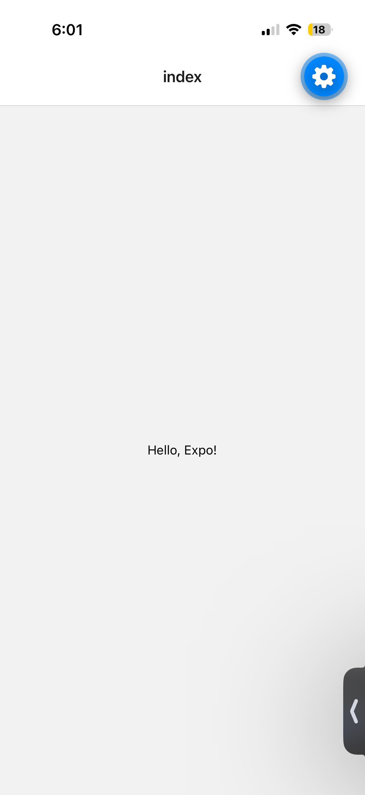

# cs262-assignment-1

app/index.tsx - this app affects the interface of the screen
package.json- stores the packages/libraries used in the project and their version
node_modules/ - modules downloaded frrom npm install that are written by others for everyone to use
README.md - it is a markdown file for projects that describes the app/code and how it works , what it's about

